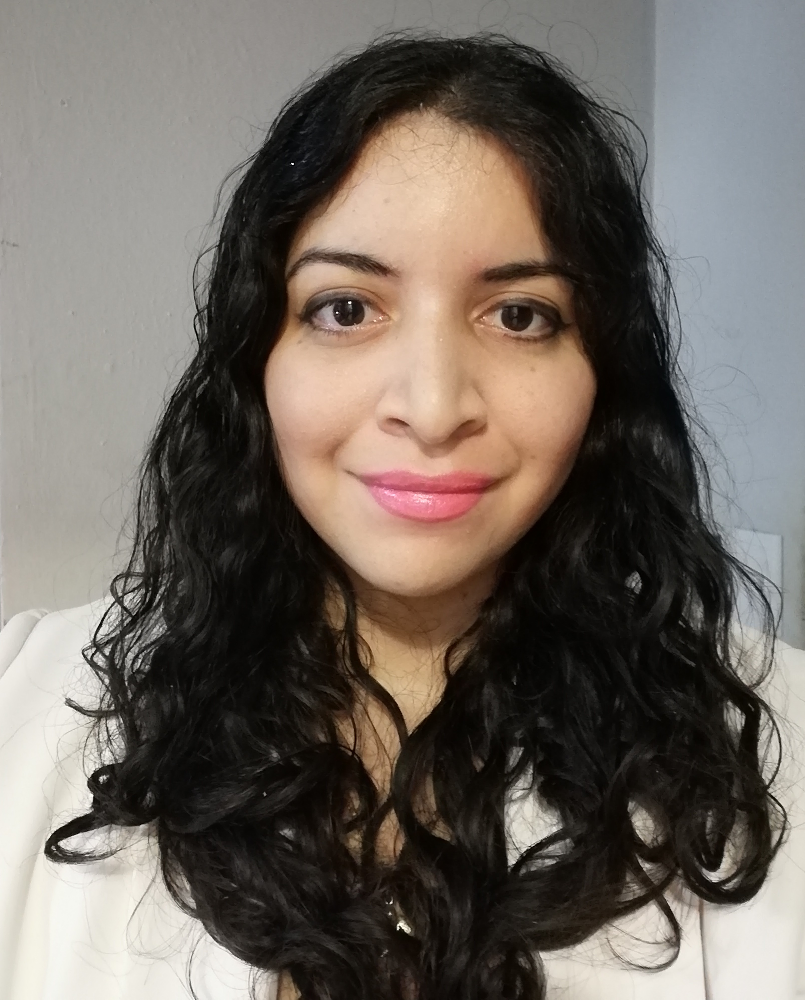

### ***Nini Ortiz Vales***
    Computational Biology & Bioinformatics
    
   
## Who am I?
Hello! I am Nini Ortiz Vales. I am an independent Computational Biologist. I love studying  Morphogenesis, Regeneration , Cancer and Aging from the perspective of Cognitive, informational and computational sciences. Not forgetting the Molecular, Biochemical, Epigenetic and gene regulatory networks that are inseparable from the Bioelectric mechanisms that cells employ to sense their environment, compute synchonyzed decisions  that result in the development of an embryo , maintenance of the anatomy of a tissue , regeneration from an injury. And of course, how these control mechanisms break-down as we age.

## Where do I come from ?
 I was born and raised in Mérida, Yucatán México. I am affiliated with the Virology lab of the CIR-Hideyo Noguchi research center of the Autonomous University of Yucatán and The Youth  Science Association of Mérida Yucatán (AJC) which is a volunteer group that teaches science to  minorities and poverty-stricken communities and makes many science communication events . Within the virology lab I work with computational models of non-Beta DNA structures and their characterization. Within AJC I am in charge of workshops and courses that relate to novel areas of Bioinformatics and Developmental Biology. I am the founder of the Robert O. Beckerlab, which will be the first DIY-Bio community lab conducting research focused on the emerging relationship between bioelectricity, regeneration ,cancer and aging.

## Are you crazy? What do you mean by Bioelectricity?
I use Bioelectricity to refer to the transmembrane potential of cells. Every cell  has a transmembrane potential (Vmem) that given certain conditions can spike in a similar way to neurons and heart-cells. Yes! Even bacteria  and animal cells can produce electric spikes, the difference are the time-scales and the overall functions bioelectricity can have in cells and tissues. For example, in _Bacillus subtilis_ biofilms , the potassium ion channel-mediated bioelectrical signaling can attract distant cells to the periphery of the biofilm [1] and also nutrient-deprived B. subtilis cells in the interior of the colony use electrical communication to transmit stress signals to the periphery, which interfere with the growth of peripheral cells and reduce nutrient consumption, thereby relieving stress from the interior [2].
 

Animal cells use GAP junctions to facilitate the transport of ions and small RNAs, they are like little "straws" that connect the membrane of one cell to the closest in proximity. GAP junctions are very important for the establishment of Bioelectrical patterns. These patterns are generated by distinct regionalizations of ion distributions that in some instances precede the formation of complex organs like the eye in Xenopus Laevis [3]. Bioelectrical patterns also work in a similar fashion to morphogens because the electric potentials generated at the cellular membrane attract ion species, producing regions that have a more acid or basic pH, this as a consequence produces changes in the structure of the chromatin and the epigenetic machinery. Thus, changing gene expression. Which is why by studying the of bioelectrical patterns during regeneration or development we can begin to grasp the computational language of cells.
 

[1] Humphries, J., Xiong, L., Liu, J., Prindle, A., Yuan, F., Arjes, H. A., ... & Süel, G. M. (2017). Species-independent attraction to biofilms through electrical signaling. Cell, 168(1-2), 200-209.
 
[2] Martinez-Corral, R., Liu, J., Prindle, A., Süel, G. M., & Garcia-Ojalvo, J. (2019). Metabolic basis of brain-like electrical signalling in bacterial communities. Philosophical Transactions of the Royal Society B, 374(1774), 20180382.
 
[3]Pai, V. P., Aw, S., Shomrat, T., Lemire, J. M., & Levin, M. (2012). Transmembrane voltage potential controls embryonic eye patterning in Xenopus laevis. Development (Cambridge, England), 139(2), 313–323. https://doi.org/10.1242/dev.073759

## Why Bioelectricity interests me?
- Because,during development and regeneration there are bioelectrical patterns that precede the formation of organs, they dictate the head-tail configuration (polarity) of  nematodes like _D.Japonica_ and are escencial for the correct patterning of the neural tube and creaniofacial features in humans and Xenopus laevis. When  _D.Japonica_  are cut in 2 the regions that will become the head and the tail will have a distinct bioelectric pattern. Bioelectricity seems to be ancient. Since, the last known common ancestor cell (LUCA) was theorized to have had ion channels and the diversification of metazoan life during the cambrian explosion correlates with the diversification of ion and voltage-gated channels as well with the emergence of animals with true brains . 

- Bioelectricity is also theorized to be used by cells as an efficient mechanism to convey,represent, store and process information. Which is why the study of the mechanistic principles and rules that make cells work togheter towards complex goals is in a sense fundamental to understand the cognitive basis of life.  These ideas are not properly my own, it was  inspired by the discoveries made by scientists I admire like Dr. Michael Levin, Dr. Adam Cohen, Dr. Gürol M. Süel, Dr. Alexis Pietak ,  Dr. Stephen M. Fuchs , Dr. Eric P. Hoel , Dr. Benjamin E. Wolfe, Dr. Jessica L.Whited , Dr. Michael B. Elowitz  and  many others.

## What is my aim?
- To undersand the role bioelectricity plays in the spatio-temporal representation and processing of information at the cellular membrane of cells, the execution of computational tasks, the integration and fusing multiple inputs at different scales of organization and  the generation of complex responses at the individual or tissue level. 

- To reveal why spatio-temporal regionalizations of ion distributions that are caused by distinct bioelectric patterns can alter the patterning of a tissue, the regeneration of an organ and the development of an individual. 

- To commmunicate to the local and regional scientific community about recent discoverys and dynamical models of Bioelectricity and their relationship with development, regeneration, cancer and aging.

## How DIY-Bioelectricity could help us achieve this goal?
From bacterial biofilms to human communities. When many individuals are focused in a goal it is not only more easy to achieve it, we can fullfil it within a shorter period of time. Nevertheless, at the time there is no grass-roots movement in the DIY-Bio  or Biochacking community that wants to tackle this challenge. For this reason I want to start such a movement, even if there are many challenges ahead I believe it is not impossible with enough determination and resolve .

## How can **you** help?
Join the **Robert O. Becker lab** or **contact me!** If you live to far away, you can also help by checking the future repos I will be uploading to my github and spreading the word!.
_Here I will list some ideas I believe we need to discuss and develop in order to stablish a DIY-Bioelectricity grassroots movement:_
- How can we guarantee reproducible research?
-What laboratory equipment and reagents we will need to build a DIY-Biolectricity lab?
- Under what guidelines, international laws and space-restrictions we will operate?
- What do wee need in order to acquire animal models in synchrony with international laws and standards that regulate their use?
- Depending on the animal model, What software  we  can implement or create to expand some areas of bioelectricity-related research? 

## Visit the Robert O. Becker Lab !

https://niniortiz.github.io/robert.o.becker.lab/"

         
## Contact
Send me an  e-mail at:  niniortiz99@gmail.com

## About the workshop I gave about the  prediction of RNA structures at Datostada

 

Within this workshop I taught my students about the importance of the secondary structure of the RNA molecule to many cellular functions and why perturbing the stability of the genome of any virus can hinder or enhance the viability of its life cycle. I taught my sudents to measure the stability of the RNA molecule by calculating the minimum folding energy of a sequence using RNAfold [4] that can be found within the ViennaRNA package combined with a sliding window analysis. To do this, with a Jupyter Notebook we took the orf1ab domain  of the sars-cov-2 genome that contains the sequence of the Rdrp protein  that is escential for the life cycle of the novel sars-cov-2 and  conducted a sliding window analysis. We calculated the minimum folding energy of 100 nucleotide (nt) windows advancing by 1 nt acoss the first 1000 nt of the orf1ab domain using the default parameters of RNAfold. After that, we  conducted a second sliding window analysis wherein the baseline parameters were disrupted to calculate how the minimum folding energy changed through all windows. Since, the minimum folding energy of all windows became more negative it was highly plausible that the sequence for the first 1000 nt of the orf1ab domain became more unstable. We concluded that by altering the baseline conditions of the intracellular medium and  using chemical reagents that interact directly with the RNA molecule we can alter the stability of the RNA molecule. If the RNA secondary structure became more unstable, we would observe an increase in non-canonical RNA conformations and secondary RNA structures that could form interactions with other genomic regions and other secondary structures.  These have inhibit the transcription of the Rdrp protein or alter its function. We wrapped up this workshop with the generation of models of the windows with the most negative minimum folding energy (which are the most unstable) using Forgi [5] in both sliding window analyses.

 
Visit the repository at: https://github.com/NiniOrtiz/Taller-COVID19-datostada   
 

[4] Lorenz, Ronny and Bernhart, Stephan H. and Höner zu Siederdissen, Christian and Tafer, Hakim and Flamm, Christoph and Stadler, Peter F. and Hofacker, Ivo L.
ViennaRNA Package 2.0 Algorithms for Molecular Biology, 6:1 26, 2011, doi:10.1186/1748-7188-6-26 
  
 [5]“3D based on 2D: Calculating helix angles and stacking patterns using forgi 2.0, an RNA python library centered on secondary structure elements.” Bernhard C. Thiel, Irene K. Beckmann, Peter Kerpedjiev and Ivo L. Hofacker. F1000 Research, in preparation

