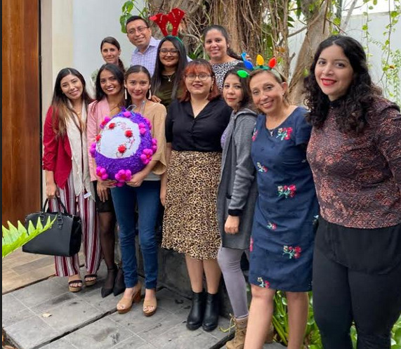

# Welcome!


## Who am I?
Hello! I am Nini Ortiz Vales. I am an independent Computational Biologist. I love studying  Morphogenesis, Regeneration , Cancer and Aging from the perspective of Cognitive, informational and computational sciences. Not forgetting the Molecular, Biochemical, Epigenetic and gene regulatory networks that are inseparable from the Bioelectric mechanisms that cells employ to sense their environment, compute synchonyzed decisions  that result in the development of an embryo , maintenance of the anatomy of a tissue , regeneration from an injury ( and in some animals regeneration of complete appendages). And of course, how these control mechanisms break-down as we age.

## Where do I come from ?
 I was born and raised in Mérida, Yucatán México. I am affiliated with the Virology lab of the CIR-Hideyo Noguchi research center of the Autonomous University of Yucatán and The Youth  Science Association of Mérida Yucatán (AJC) which is a volunteer group that teaches science to  minorities and poverty-stricken communities and makes many science communication events . Within the virology lab I work with computational models of non-Beta DNA structures and their characterization. Within AJC I am in charge of workshops and courses that relate to novel areas of Bioinformatics and Developmental Biology.
 
## What organizations do I belong?
|   |  |  
|:-:|:-:|:-:|
|  AJC | Virology lab at CIR-Hideyo Noguchi  | Datostada  | 
    

## Are you crazy? What do you mean by Bioelectricity?
I use Bioelectricity to refer to the transmembrane potential of cells. Every cell  has a transmembrane potential (Vmem) that given certain conditions can spike in a similar way to neurons and heart-cells. Yes! Even bacteria  and epithelial tissues can produce electric spikes, the difference are the time-scales. Also, metazoan cells, have a type of junction called GAP junction, these small junctions facilitate the transport of ions and small RNAs. GAP junctions are very important for the establishment of Bioelectrical patterns. These patterns are generated by distinct regionalizations of iion distributions that in some instances precede the formation of complex organs like the eye in Xenopus Laevis. Moreover, during a developmental stage if you change the K+ pattern of a certain region of pluripotent cells , the Xenopus embryo produces an inervated ectopic eye!.

## Why Bioelectricity interests me?
Because,during development and regeneration there are bioelectrical patterns that precede the formation of organs, in other instances these bioelectrical patterns dictate the polarity ( or the head-tail configuration) a nematode will have when cut in 2. Bioelectricity is ancient, since the Last known common ancestor (LUCA) had some form of channels. Moreover, multicellularity and cognition emerge with the diversification of transmembrane channels. Any ion channel, voltage-gated ion channel can either be in two states: open or closed. This means that information about the dynamical state of a cell can be conveyed to other cells through these channels and GAP junctions.  Which is why by studying the evolution of bioelectrical patterns during regeneration or development we can begin to grasp the computational language of cells. These ideas are not properly my own, it was  inspired by the discoveries made by scientists I admire like Dr. Michael Levin, Dr. Adam Cohen, Dr. Gurol Suel and many others at the Levin lab, the center for Regenerative Medicine at Tufts, The Allen Discovery Center at Tufts, The Weiss center, The Suel lab, etc.  

## What is my aim?
To understand the rules and coupling mechanisms between bioelectrical patterns,cognitive-networks, gene-regulatory networks , epigenetic and molecular mechanisms that living beings use to produce stable anatomical patterns and why they break down when they age.

## How DIY-Bioelectricity could help us achieve this goal?
From bacterial biofilms to human communities. When many individuals are focused in a goal it is not only more easy to achieve it, we can fullfil it within a shorter period of time. Nevertheless, at the time there is no grass-roots movement in the DIY-Bio  or Biochacking community that wants to tackle this challenge. For this reason I want to start such a movement, even if there are many challenges ahead I believe it is not impossible with enough determination and resolve .

## How can YOU help?
Contact me! You can check my(future) repos I will be uploading  with info on Morphogenesis, regeneration, guides to use software that can predict bioelectrical patterns, easy Jupyter noteworks explaining state of the art computational models of recent bioelectricity-related discoveries. We can form a team and start planning(plotting.. ). There are many areas we need to research in order to make this grassroots movement a reality, in the next paragraphs I will enlists some ideas but you can also help learning and sharing how to use BETSE and other software used at the main universities currently researching bioelectricity.

## About the workshop I gave about the  prediction of RNA structures in Datostada


```markdown
Syntax highlighted code block

# How can we create reproducible research?
## How can we use animal models approving international standards and laws that regulate their use?
### What new code can we create to expand some areas of bioelectricity-related research ? 

- Bulleted
- List

1. Numbered
2. List

**Bold** and _Italic_ and `Code` text

[Link](url) and 
```

For more details see [GitHub Flavored Markdown](https://guides.github.com/features/mastering-markdown/).

### Jekyll Themes

Your Pages site will use the layout and styles from the Jekyll theme you have selected in your [repository settings](https://github.com/NiniOrtiz/niniortiz.github.io/settings). The name of this theme is saved in the Jekyll `_config.yml` configuration file.

### Support or Contact

Having trouble with Pages? Check out our [documentation](https://help.github.com/categories/github-pages-basics/) or [contact support](https://github.com/contact) and we’ll help you sort it out.
